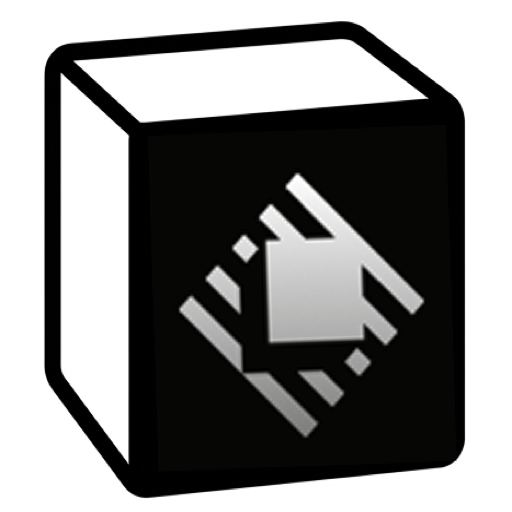

# Notion Snippets for Raycast

Turn your Notion databases into a high-performance snippet manager for Raycast. Sync code snippets, canned responses, microblogs, and bookmarks instantly.
Support **Hybrid Search** (Local Instant + Global Cloud) and **Import to Raycast Native Snippets**.

将你的 Notion 数据库变身为 Raycast 加强版 Snippet 管理器。秒速同步代码片段、常用语、微博客和书签。
支持 **混合搜索模式** (本地秒开 + 云端检索) 和 **导入到 Raycast 原生 Snippet**。

 

## ✨ Features / 功能亮点

- **🚀 Hybrid Search Engine / 混合搜索引擎**:
  - **Local Acceleration / 本地加速**: The latest 100 snippets are cached locally for 0-latency instant search. (本地缓存最新的 100 条数据，实现 0 延迟秒开搜索)
  - **Global Cloud Search / 全局云搜索**: Search terms not found locally will automatically trigger a Notion Cloud search. (本地未找到时，自动触发 Notion 全局云端搜索，海量数据也能搜)
  - **CJK Optimized / 中文优化**: Intelligent exact matching for CJK characters prevents fuzzy noise. (针对中文优化的精确匹配算法，告别模糊搜索的干扰)

- **🧩 Native Integration / 原生级集成**:
  - **Import to Raycast / 一键导入 Raycast**: One-click import Notion snippets into Raycast's native snippet manager (Cmd+Shift+I). (支持一键将 Notion 内容导入到 Raycast 原生 Snippet 管理器，从此告别复制粘贴)
  - **Rich Metadata / 丰富元数据**: Hover to view full titles, tags, and source database info. (悬停查看完整标题、标签和来源数据库)

- **🧠 Smart Support / 智能兼容**:
  - **Microblogs / 微博客模式**: "Say" DB support - automatically titles "Untitled" posts with their content. (支持 "Say" 微博客模式，自动将无标题内容的首行作为标题展示)
  - **Bookmarks / 书签模式**: "Media" DB support - intelligent URL handling. (支持 "Media" 书签模式，智能解析 URL)

 

## 🛠 Setup Guide / 设置指南

### 1. Create Integration (创建集成)

1. Go to [Notion My Integrations](https://www.notion.so/my-integrations).
   (前往 Notion 集成页面。)
2. Create a new integration (e.g., "Raycast Snippets").
   (创建一个新集成，例如叫 "Raycast Snippets"。)
3. **Copy the "Internal Integration Secret"**.
   (复制 "Internal Integration Secret"。)

### 2. Connect Databases (连接数据库)

You can use any database. The extension intelligently maps the following fields:
(你可以使用任何数据库。插件会智能匹配以下字段：)

- **Name (标题)**: `Name`, `Title`, `Subject`, `In`
- **Content (内容)**: `Content`, `Body`, `Code`, `URL`, `Link`
- **Trigger (快捷键)**: `Trigger`, `Keyword`, `Shortcut`
- **Description (描述)**: `Description`, `Notes`, `Tags`

**Important (重要)**:
Click the `...` menu on your Notion Database page -> `Connections` -> **Add your integration**.
(在 Notion 数据库页面点击 `...` 菜单 -> `Connections` -> **添加你的集成**。)

### 3. Configure Raycast (配置插件)

1. Install this extension. (安装本插件。)
2. In Raycast Settings -> Extensions -> Notion Snippets:
   - **Notion Token**: Paste your secret starting with `secret_...` (填入 `secret_` 开头的密钥)
   - **Database IDs**: Paste your Database ID(s). Comma separate for multiple. (填入数据库 ID，多个用逗号分隔)

_(The Database ID is the 32-char code in your Notion URL / 数据库 ID 是 Notion URL 中的 32 位字符: `notion.so/myworkspace/THIS_PART_IS_THE_ID?v=...`)_

 

## ⚡️ Quick Actions / 快捷操作

| Shortcut          | Action                | Description                                                          |
| :---------------- | :-------------------- | :------------------------------------------------------------------- |
| `Enter`           | Paste Snippet         | Paste content to active app (fills placeholders). (粘贴到当前应用)   |
| `Cmd + K`         | Actions Menu          | Show all available actions. (显示所有操作菜单)                       |
| `Cmd + N`         | Create New            | Create a new snippet directly to Notion. (新建 Snippet 到 Notion)    |
| `Cmd + E`         | Edit Snippet          | Edit the selected snippet. (编辑选中 Snippet)                        |
| `Cmd + Shift + I` | **Import to Raycast** | Import to native Raycast Snippets. (**导入到 Raycast 原生 Snippet**) |
| `Cmd + Shift + E` | Export All            | Export snippets to JSON/CSV. (导出所有 Snippet)                      |

 

## 💡 Pro Tips / 使用技巧

- **Hidden Results / 隐藏结果提示**: If you search for something and see a "Hidden Results" warning, it means the content exists in Notion but that database hasn't been added to your settings yet. (如果你搜索时看到 "Hidden Results" 提示，说明内容在 Notion 中存在，但该数据库尚未添加到插件设置中。)
- **Performance /性能**: The extension is memory-safe. It keeps your recent 100 items hot-loaded for instant access, while older items are searched on-demand from the cloud. (插件内存安全。它将你最近的 100 条内容热加载到本地以实现秒开，更早的内容则按需云端搜索。)

 

## License

MIT
